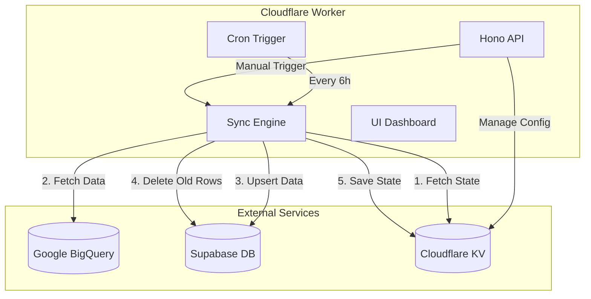
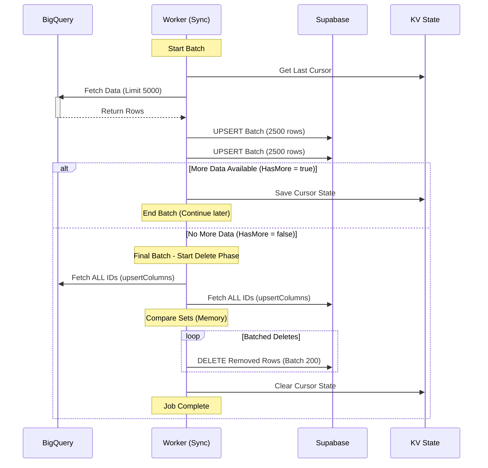

# Documentación Técnica: AdCreativeFlow DB Sync

## 📋 Descripción General

**AdCreativeFlow DB Sync** es un servicio serverless implementado como un **Cloudflare Worker** diseñado para sincronizar datos masivos desde **Google BigQuery** (origen) hacia **Supabase/PostgreSQL** (destino).

El sistema funciona de manera autónoma mediante cron triggers (programados cada 6 horas) o puede ser invocado manualmente vía API. Su objetivo principal es mantener una réplica actualizada de los datos analíticos para su uso en aplicaciones frontend, manejando tanto inserciones/actualizaciones como la eliminación de registros obsoletos.

---

## 🏗 Arquitectura

El proyecto está construido sobre las siguientes tecnologías:

- **Runtime**: Cloudflare Workers (Edge Computing).
- **Framework**: Hono (Servidor web ligero y tipado).
- **Almacenamiento de Estado**: Cloudflare KV (Key-Value Store) para configuraciones y cursores de paginación.
- **Origen de Datos**: Google BigQuery (API REST con autenticación JWT vía Service Account).
- **Destino de Datos**: Supabase (Cliente JS oficial).
- **Dashboard**: Interfaz web estática (HTML/JS) servida desde el mismo Worker para gestionar configuraciones.



---

## ⚙️ Flujo de Sincronización

El proceso de sincronización (`handleSync`) es el núcleo del sistema y sigue un flujo robusto diseñado para manejar grandes volúmenes de datos y evitar timeouts.

### 1. Inicialización y Validación de Esquema
Al iniciar un trabajo (Job):
1. **Fetch Metadata**: Obtiene el esquema de la tabla origen en BigQuery.
2. **Sync Schema**:
   - Crea la tabla en Supabase si no existe.
   - Detecta diferencias de columnas (nuevas o eliminadas).
   - Aplica cambios DDL (`ALTER TABLE`) automáticamente para mantener ambos esquemas idénticos.
3. **Validación**: Verifica que las `upsertColumns` (claves únicas) existan y sean válidas.

### 2. Sincronización Incremental (Insert/Update)
El sistema utiliza una estrategia de paginación por cursores para procesar datos eficientemente:

- **Batching**: Procesa registros en lotes de 5,000 filas desde BigQuery.
- **Sub-batching**: Inserta en Supabase en sub-lotes de 2,500 filas para respetar límites de tamaño de payload.
- **Upsert**: Utiliza la operación `UPSERT` (Insertar o Actualizar) basada en las columnas clave definidas (`upsertColumns`).
- **Persistencia de Estado**: Guarda el progreso en KV. Si el Worker se detiene por límites de tiempo (15 min), la próxima ejecución retoma exactamente donde quedó usando el cursor compuesto (`incrementalColumn` + `tieBreaker`).

### 3. Detección y Eliminación de Borrados (Delete Phase) 🆕
Esta fase se ejecuta **solo en el último lote** de la sincronización, cuando ya no hay más datos nuevos que traer de BigQuery. Su objetivo es mantener la consistencia eliminando registros que ya no existen en el origen.

#### Estrategia "Hybrid Approach"
Diseñada para soportar tablas de hasta 1 millón de filas sin exceder los límites de memoria (128MB) o CPU del Worker.

1. **Fase de Obtención (Fetch)**:
   - Descarga **todos** los IDs (`upsertColumns`) de BigQuery (consulta ligera, ignora filtros incrementales).
   - Descarga **todos** los IDs de Supabase mediante paginación (bloques de 10,000 registros).

2. **Fase de Comparación (Compare)**:
   - Carga los IDs en memoria usando estructuras `Set` de JavaScript para una comparación O(n) rápida.
   - Identifica los IDs que existen en Supabase pero **NO** en BigQuery.
   - Serializa claves compuestas usando JSON para garantizar precisión (ej: `["id1", "2024-01-01"]`).

3. **Fase de Eliminación (Delete)**:
   - Ejecuta eliminaciones físicas (`DELETE`) en Supabase.
   - Procesa en lotes de **200 registros** para evitar límites de longitud de URL en la API de Supabase.

#### Mecanismos de Seguridad (Circuit Breakers)
Para evitar desastres (como borrar toda una tabla por error), el sistema incluye protecciones estrictas:

- ⛔ **Abortar si BigQuery = 0**: Si BigQuery retorna 0 filas, se asume un error de conexión o configuración y se aborta el proceso de borrado.
- ⛔ **Límite del 50%**: Si el sistema detecta que debe eliminar más del 50% de la tabla de destino, aborta la operación y lanza un error, asumiendo que es una anomalía que requiere revisión manual.
- ⏭️ **Skip en Primer Sync**: Si la tabla de Supabase está vacía, se salta esta fase para optimizar recursos.



---

## 🛡️ Seguridad y Autenticación

- **API Security**: Todos los endpoints del Worker están protegidos por un `Bearer Token` (`SYNC_API_KEY`).
- **BigQuery Auth**: Utiliza una Service Account de Google. Genera y firma JWTs (JSON Web Tokens) internamente usando la librería `jose` para autenticarse con la API de Google Cloud.
- **Supabase Auth**: Utiliza la URL y Service Role Key de Supabase para tener permisos de administración (DDL y manipulación de datos).

---

## 📊 Configuración de Jobs

Los trabajos se configuran mediante objetos JSON almacenados en KV (`SYNC_CONFIGS`).

**Estructura del JSON:**

```json
{
  "id": "job_marketing_data",
  "name": "Marketing Data Sync",
  "enabled": true,
  "bigquery": {
    "projectId": "mi-proyecto-gcp",
    "datasetId": "analytics",
    "tableOrView": "marketing_kpis",
    "incrementalColumn": "updated_at", // Opcional: para sync incremental
    "forceStringFields": ["ad_id"]     // Opcional: para preservar precisión de IDs largos
  },
  "supabase": {
    "tableName": "marketing_kpis",
    "upsertColumns": ["ad_id", "date"] // Clave única compuesta
  }
}
```

---

## 🚦 Monitoreo y Logs

El sistema genera logs estructurados que se almacenan en KV (`SYNC_LOGS`) y son visibles desde el dashboard.

- **Niveles**: INFO, SUCCESS, WARNING, ERROR, DEBUG.
- **Resumen Final**: Al terminar, genera un resumen legible:
  > *"15,000 rows synced, 320 deleted in 2m 45s"*

---

## 🚀 Despliegue

```bash
# Instalar dependencias
npm install

# Desarrollo local
npm run dev

# Desplegar a producción
npm run deploy
```
